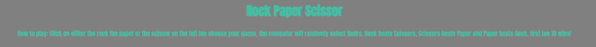

# JS RPS

JS RPS is a site that host a rock paper scissors game agaisnt the computer in javascript. this site is targeted at people who enjoy a good Rock paper scissors game in their free time.
  

# Wireframes

The wireframes for JS RPS were created in Balsamiq. it covers the Mobile version. The final site is quite similar too the wireframe, the only big change being that a username submit button was added.

# Design Choices
`###` typography    

The Font used was Anton, a more bold font used too make the site look fuller.
# Features

JS RPS has many cool features inculding rock paper scissor buttons that grow in size when hovered. a scorecard that goes up too 10. an input area for your Username that will take the place of 'player 1'

## Existing Features
 
### Header

The header shows of a clean title and how to play section that instructs users on how the game works.

### Game Section

The game Section is where players will make their choice of rock paper or scissors too beat the computer. After a choice is made the game will show you your choice the computers choice and the result.

 

### Score and Input Section

At the bottom we see the score and a input section for the user too put their name. this name replaces the player 1 text.

# Testing

This site was tested and works on Google Chrome, Opera(based on Firefox) and Microsoft Edge.
All  buttons work on all sites and the game fuctions on all sites.

  

# Known Bugs

## Resloved

During validation two bugs became known during the validation stage, a brief description is below:

 

during deployment this came up, it was an ovesight from previewing through the terminal

## Unresolved

this bug has pained me all through the project and i have still yet too figure out why it exists, for some reason it doesnt line up.
this is only viewable if you scroll diagonally and viewed from smaller device's its not there.

# Deployment

* My site was deployed on Github Pages, following these steps
  * In the GitHub repository, navigate to the Settings tab.
  * Once in Settings, navigate to the Pages tab on the left hand side.
  * Under Source, select the branch to master, then click save.
  * Once the master branch has been selected, the page will be automatically refreshed with a detailed ribbon display to indicate the successful deployment.

You can find the link [here](https://patrickvddd.github.io/HelsingborgGamingClub/)

# Credits

## Content
  * The font came from [google fonts](https://fonts.google.com)
  * The map is embedded from [google maps](https://www.google.com/maps)
  * The icons came from [font awesome](https://fontawesome.com)
  * The phots are from [pexels](https://pexels.com)
  * [balsamiq](https://balsamiq.com) was used to create the wireframes.

  
  The site was completed as a Portfolio 1 Project piece for the Full Stack Software Developer  Diploma at the Code Institute. 

Patrick van Daal 2024
